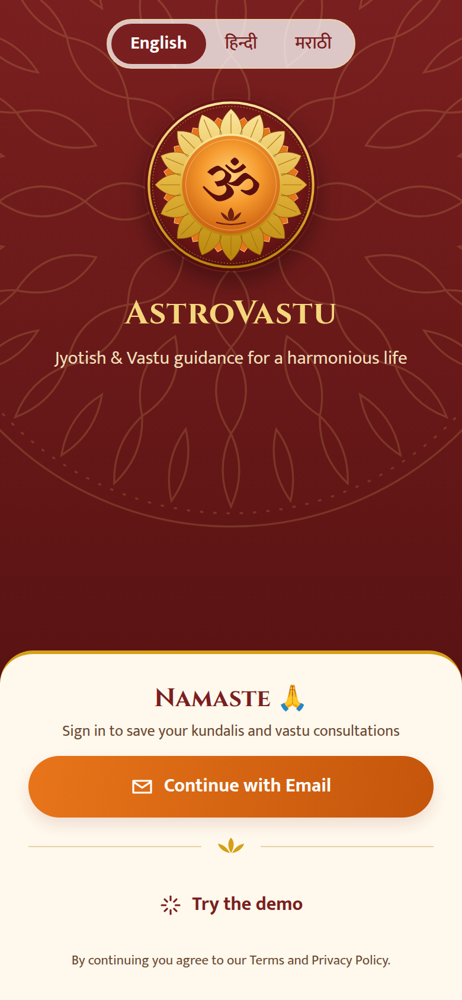
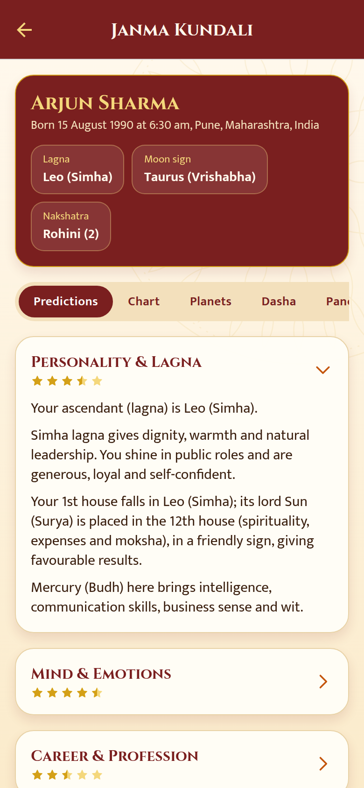
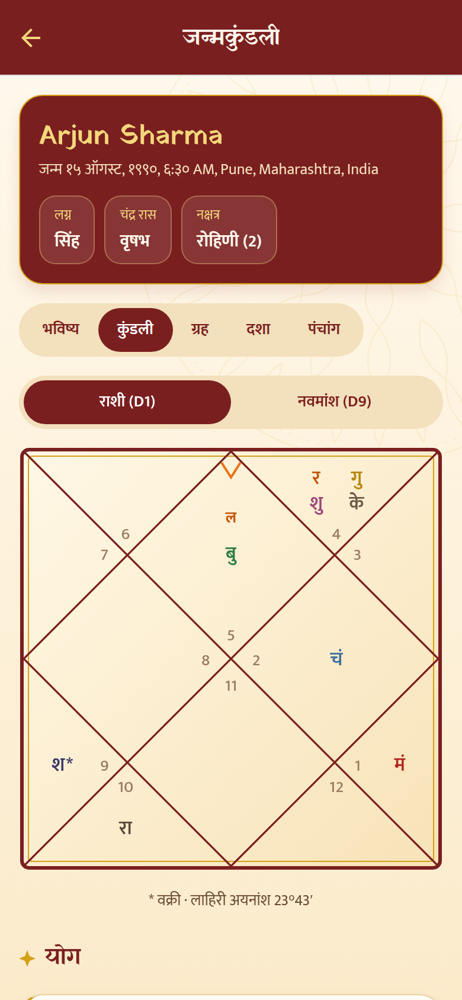
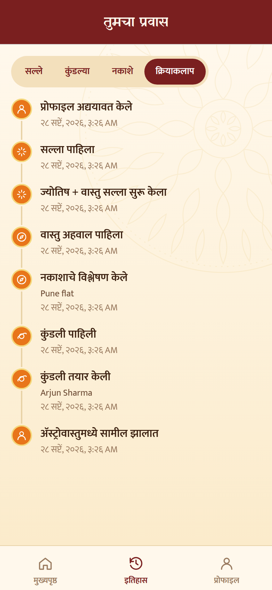

# AstroVastu

A mobile app for **Vedic astrology (Jyotish)** and **Vastu Shastra** guidance, in **English, हिन्दी and मराठी**, with a backend that stores each user's kundalis, vastu analyses, consultations and activity history.

```
astrovastu/
├── mobile/    Expo (React Native) app for iOS, Android and web
└── backend/   Node.js + TypeScript API (Express, SQLite)
```

<p align="center">
  
  
  
  
</p>
<p align="center">
  
  
  
  
</p>

## What it does

| Flow | Steps | Output |
|---|---|---|
| **Consult Astro** | Name, gender, date/time of birth, birth place (searchable, with time zone) | Janma kundali: North-Indian Rasi (D1) and Navamsa (D9) charts, planet table (sign, degree, nakshatra, pada, dignity, retrograde, combust), janma panchang, Vimshottari maha/antar dasha timeline, yogas, doshas (Mangal, Kaal Sarp, Sade Sati), remedies, and life predictions by area (personality, mind, career, wealth, marriage, health, education/children, dharma) with a 1–5 star strength rating |
| **Consult Vastu** | Upload/photograph a floor plan → rotate the dial to mark **North** → tap to tag kitchen, living room, bedrooms, toilets, entrance, pooja room, and so on (optionally set the Brahmasthan) | A **circular 16-direction (shodasha) vastu grid** drawn over the plan, a room-by-room verdict and remedies, a 0–100 vastu score, status for all 16 zones, and general tips |
| **Consult Astro + Vastu** | Pick a saved kundali or enter new birth details, then pick a saved plan or add a new one | Both reports, plus **vastu personalised to the kundali**: lagna-lord and dasha-lord directions, directions that suit your Moon sign's element, sleeping/working orientation, and alerts when a toilet or store room sits in one of your chart's key zones |

Everything is saved per user. The **History** tab lists consultations, kundalis and floor plans, and shows an activity timeline (sign-ins, created/viewed/deleted records, and so on).

### Login
Google, Facebook, Sign in with Apple (iOS), and email/password. A one-tap **demo login** is available in development. Each button only appears when that provider is configured on both the app and the server. Accounts are linked by verified email, and users can delete their account from the app (an App Store / Play Store requirement).

### Look and feel
A dharmic palette of saffron, sindoor maroon, temple gold and sandalwood parchment, with rangoli-style mandala watermarks. The emblem is a ॐ on a rising-sun disc inside **16 lotus petals**, one for each vastu direction (`mobile/src/components/logoSvg.ts`). Typefaces are **Cinzel** for English headings, **Yatra One** for Devanagari headings, and **Mukta** for body text in all three languages.

## How the engines work

**Kundali** (`backend/src/astro/`)
- Planetary positions come from [`astronomy-engine`](https://github.com/cosinekitty/astronomy) (VSOP87/ELP-grade accuracy). The ascendant and MC come from sidereal time and obliquity. Rahu/Ketu use the mean lunar node.
- The zodiac is sidereal with the **Lahiri (Chitrapaksha)** ayanamsa, and houses are whole-sign from the lagna.
- Birth time is converted to UTC with the IANA tz database (via Luxon), so historical offsets are handled.
- Predictions are rule-based and deterministic: lagna and Moon-sign traits, house-lord placement and dignity, occupants, yogas and dashas. The text is written natively in all three languages (`astro/content/{en,hi,mr}.ts`), not machine-translated.
- Tests check the engine against known facts. For example, the ascendant equals the Sun's longitude at sunrise, the Sun enters sidereal Capricorn at Makar Sankranti, and the Lahiri value at J2000 is correct.

**Vastu** (`backend/src/vastu/`)
- A room's zone is its bearing from the Brahmasthan, measured relative to the North you marked. This accounts for the plan's aspect ratio. Each of the 16 zones spans 22.5°, with N centred on 0°, and points near the centre count as Brahmasthan.
- A per-room × per-zone rule table (`rules.ts`) rates each placement from *excellent* to *vastu dosha*. The overall score is weighted by room importance, and major doshas are penalised.
- The app draws the same geometry live (`mobile/src/lib/vastu.ts`), so the preview matches the analysis.

**Optional AI (Claude)**: if `ANTHROPIC_API_KEY` is set, two extras switch on:
1. A narrative "deeper reading" in the user's language, grounded only in the computed chart facts.
2. **Auto-detect rooms** on an uploaded floor plan (room types, positions, and the plan's north arrow). The user reviews the result before analysing.

The app works fully without a key; the AI buttons are simply hidden.

## Running locally

Requires **Node.js 22.13+**.

```bash
# 1. Backend
cd backend
npm install
cp .env.example .env        # optional: add OAuth/AI keys
npm run dev                 # http://localhost:4000
npm test                    # 25 tests: engines + API integration

# 2. App
cd ../mobile
npm install
cp .env.example .env        # set EXPO_PUBLIC_API_URL (use your LAN IP on a phone)
npx expo start              # press i / a / w for iOS, Android, web
```

For social login, set these environment variables:
- **Google**: create OAuth client IDs (web, iOS, Android) in Google Cloud. Put them in `EXPO_PUBLIC_GOOGLE_*_CLIENT_ID` (app) and `GOOGLE_CLIENT_IDS` (server).
- **Facebook**: `EXPO_PUBLIC_FACEBOOK_APP_ID` (app), plus `FACEBOOK_APP_ID` and `FACEBOOK_APP_SECRET` (server). The server checks tokens against your app with `debug_token`.
- **Apple**: works in iOS builds. Set `APPLE_AUDIENCES` to the bundle id (`com.astrovastu.app`).

Google/Facebook/Apple sign-in and the camera need a development build (`npx expo run:ios|android` or `eas build --profile development`), not Expo Go.

Regenerate icons and splash from the emblem with `cd mobile && npx tsx scripts/generate-icons.ts`.

## API overview (`/api/v1`)

| Area | Endpoints |
|---|---|
| Auth | `GET /auth/providers`, `POST /auth/{google,facebook,apple,register,login,demo,logout}` |
| Profile | `GET/PATCH/DELETE /me` |
| Kundali | `POST /kundalis`, `GET /kundalis`, `GET/DELETE /kundalis/:id`, `POST /kundalis/:id/ai-reading` |
| Vastu | `POST /vastu` (multipart: `plan` image + JSON `data`), `POST /vastu/detect`, `GET /vastu`, `GET/DELETE /vastu/:id`, `GET /vastu/:id/image` |
| Combined | `POST /consultations/both`, `GET /consultations`, `GET /consultations/:id` |
| History | `GET /activity?limit&before`, `GET /activity/summary` |
| Places | `GET /geo/search?q=` (offline Indian and diaspora city list + Open-Meteo geocoding) |

Report endpoints take `?lang=en|hi|mr`. Charts are stored once, and reports are regenerated in the requested language, which also keeps dasha and Sade Sati status current.

**Storage:** SQLite through Node's built-in `node:sqlite`, with versioned migrations in `backend/src/db/schema.ts`. Tables are `users`, `auth_identities`, `kundalis`, `vastu_records`, `consultations` and `activity_log`. Floor-plan images are stored under `UPLOAD_DIR`, served only to their owner, and checked by magic bytes. A `Dockerfile` is included; mount `/data` for persistence.

## Disclaimer
Astrology and Vastu guidance here is traditional and for reflection. It is not a substitute for professional medical, legal, financial or structural advice.
