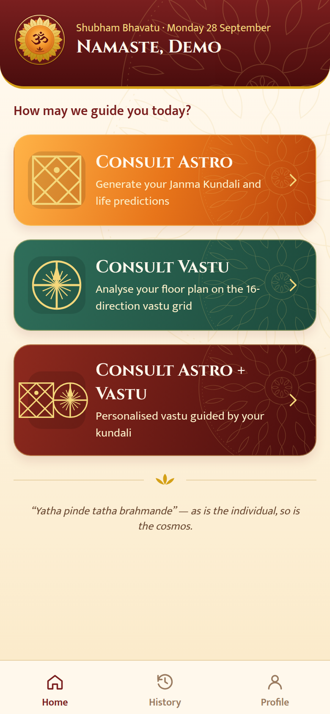
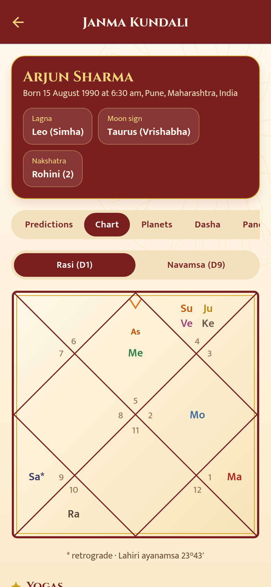
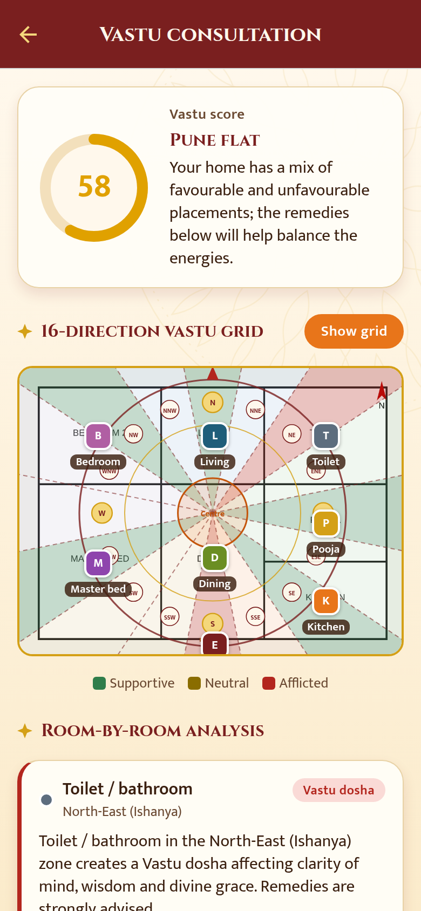
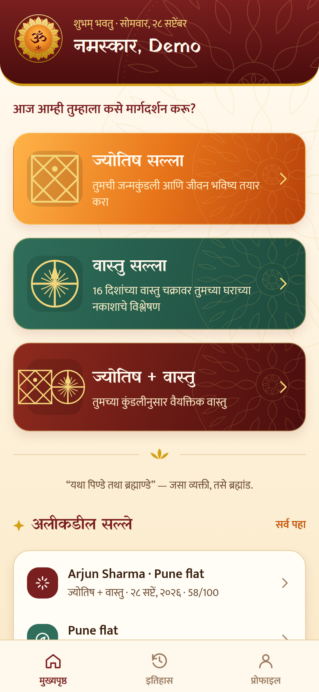

# AstroVastu

A **fully offline** mobile app for **Vedic astrology (Jyotish)** and **Vastu Shastra** guidance, in **English, हिन्दी and मराठी**. There is no server and no account: everything — computing your kundali, analysing a floor plan, and remembering your history — happens on your device.

```
astrovastu/
└── mobile/    Expo (React Native) app for iOS, Android and web
    └── src/domain/   The astrology and vastu engines (pure TypeScript, no I/O)
```

<p align="center">
  
  
  
  
</p>

## What it does

| Flow | Steps | Output |
|---|---|---|
| **Consult Astro** | Name, gender, date/time of birth, birth place (searched from a bundled gazetteer, or entered manually) | Janma kundali: North-Indian Rasi (D1) and Navamsa (D9) charts, planet table (sign, degree, nakshatra, pada, dignity, retrograde, combust), janma panchang, Vimshottari maha/antar dasha timeline, yogas, doshas (Mangal, Kaal Sarp, Sade Sati), remedies, and life predictions by area (personality, mind, career, wealth, marriage, health, education/children, dharma) with a 1–5 star strength rating |
| **Consult Vastu** | Upload/photograph a floor plan → rotate the dial to mark **North** → tap to tag kitchen, living room, bedrooms, toilets, entrance, pooja room, and so on (optionally set the Brahmasthan) | A **circular 16-direction (shodasha) vastu grid** drawn over the plan, a room-by-room verdict and remedies, a 0–100 vastu score, status for all 16 zones, and general tips |
| **Consult Astro + Vastu** | Pick a saved kundali or enter new birth details, then pick a saved plan or add a new one | Both reports, plus **vastu personalised to the kundali**: lagna-lord and dasha-lord directions, directions that suit your Moon sign's element, sleeping/working orientation, and alerts when a toilet or store room sits in one of your chart's key zones |

The **History** tab lists consultations, kundalis and floor plans, and shows an activity timeline (created/viewed/deleted records, profile changes, and so on) — all read from the on-device database.

### No accounts, no network
The app asks only for a name on first launch (used in greetings and printed on your kundali) — there's no sign-up, no password, no OAuth. Floor-plan photos are copied into the app's own storage the moment you pick them, so they aren't lost if the OS clears its temporary cache. "Reset all data" in Profile wipes everything (kundalis, floor plans, history) and starts over.

### Look and feel
A dharmic palette of saffron, sindoor maroon, temple gold and sandalwood parchment, with rangoli-style mandala watermarks. The emblem is a ॐ on a rising-sun disc inside **16 lotus petals**, one for each vastu direction (`mobile/src/components/logoSvg.ts`). Typefaces are **Cinzel** for English headings, **Yatra One** for Devanagari headings, and **Mukta** for body text in all three languages.

## How the engines work

Everything under `mobile/src/domain/` is pure, dependency-free TypeScript (no network, no filesystem) — it's the same logic whether it runs on a phone or in a test.

**Kundali** (`domain/astro/`)
- Planetary positions come from [`astronomy-engine`](https://github.com/cosinekitty/astronomy) (VSOP87/ELP-grade accuracy), bundled straight into the app. The ascendant and MC come from sidereal time and obliquity. Rahu/Ketu use the mean lunar node.
- The zodiac is sidereal with the **Lahiri (Chitrapaksha)** ayanamsa, and houses are whole-sign from the lagna.
- Birth time is converted to UTC with the IANA tz database (via Luxon), so historical offsets are handled.
- Predictions are rule-based and deterministic: lagna and Moon-sign traits, house-lord placement and dignity, occupants, yogas and dashas. The text is written natively in all three languages (`domain/astro/content/{en,hi,mr}.ts`), not machine-translated.
- Verified against known facts — for example, the ascendant equals the Sun's longitude at sunrise, the Sun enters sidereal Capricorn at Makar Sankranti, and the Lahiri value at J2000 is correct (see "Verifying the engines" below).

**Vastu** (`domain/vastu/`)
- A room's zone is its bearing from the Brahmasthan, measured relative to the North you marked. This accounts for the plan's aspect ratio. Each of the 16 zones spans 22.5°, with N centred on 0°, and points near the centre count as Brahmasthan.
- A per-room × per-zone rule table (`rules.ts`) rates each placement from *excellent* to *vastu dosha*. The overall score is weighted by room importance, and major doshas are penalised.
- The app draws the same geometry live while you tag rooms (`mobile/src/lib/vastu.ts` wraps `domain/vastu/grid.ts`), so the preview matches the saved analysis exactly.

**Birth places** (`domain/geo/cities.ts`): a bundled gazetteer of ~70 Indian and diaspora cities with coordinates and time zones, searched locally. If your city isn't listed, "Enter it manually" asks for latitude, longitude and an IANA time zone (e.g. `Asia/Kolkata`), validated on-device.

## On-device storage

- **`expo-sqlite`** holds your profile, kundalis (birth details + the full computed chart), vastu records (floor-plan geometry + tagged rooms + score), consultations linking the two, and the activity log. Schema in `mobile/src/lib/db.ts`.
- **`expo-file-system`** copies each floor-plan photo you pick into the app's own document storage (`mobile/src/lib/files.ts`), so it survives OS cache clearing; deleting a vastu record deletes its photo too.
- All reads/writes go through `mobile/src/lib/store.ts` — there's no other place in the app that touches the database.
- Nothing is synced anywhere. Uninstalling the app deletes all of it, same as any other offline app.

## Running locally

Requires **Node.js 22.13+**.

```bash
cd mobile
npm install
npx expo start        # press i / a / w for iOS, Android, web
```

Google/Facebook login, native sign-in, and similar don't exist in this app, so **Expo Go works for most of it** — the exceptions are the camera (for photographing a floor plan) and SQLite, which need a development build:

```bash
npx expo run:ios       # or: npx expo run:android
# or, without local Xcode/Android Studio:
npx eas-cli@latest build --profile development
```

**Building an installable Android APK without an EAS account:** push to GitHub and run the included `.github/workflows/build-android-apk.yml` workflow (Actions tab → "Build Android APK" → "Run workflow"). It runs `expo prebuild` + a plain Gradle build on GitHub's own Android-SDK-equipped runners and uploads the resulting `.apk` as a downloadable artifact.

Regenerate icons and splash from the emblem with `npx tsx scripts/generate-icons.ts`.

### Verifying the engines

The astrology and vastu math can be checked directly with `tsx`, independent of the app shell:

```ts
import { buildKundali } from "./src/domain/astro/kundali";
import { buildReport } from "./src/domain/astro/predictions";
const k = buildKundali({ name: "T", birthDate: "1990-08-15", birthTime: "06:30", placeName: "Pune", latitude: 18.52, longitude: 73.86, timezone: "Asia/Kolkata" });
console.log(buildReport(k, "en").summary); // { lagna: "Leo (Simha)", moonSign: "Taurus (Vrishabha)", ... }
```

## Disclaimer
Astrology and Vastu guidance here is traditional and for reflection. It is not a substitute for professional medical, legal, financial or structural advice.
